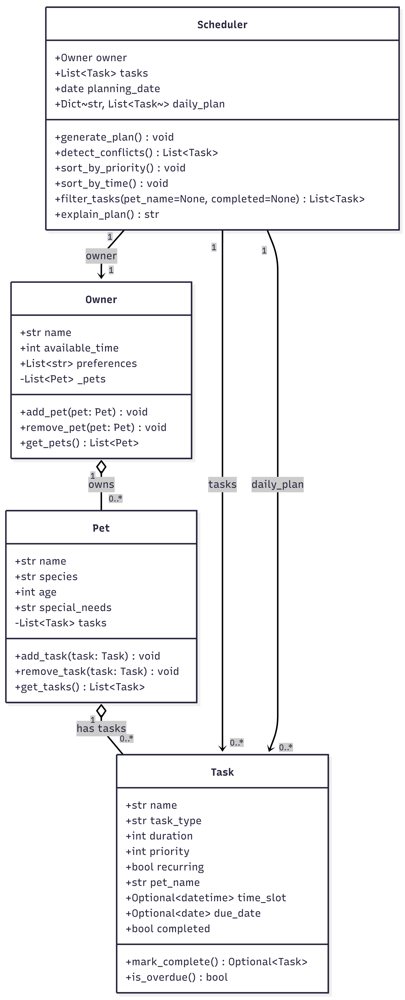
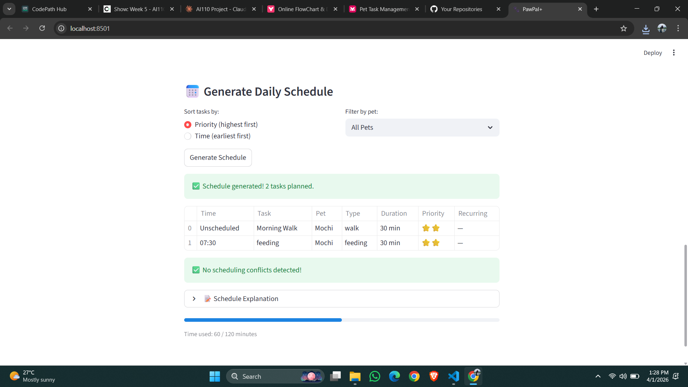

# PawPal+ (Module 2 Project)

You are building **PawPal+**, a Streamlit app that helps a pet owner plan care tasks for their pet.

## Scenario

A busy pet owner needs help staying consistent with pet care. They want an assistant that can:

- Track pet care tasks (walks, feeding, meds, enrichment, grooming, etc.)
- Consider constraints (time available, priority, owner preferences)
- Produce a daily plan and explain why it chose that plan

Your job is to design the system first (UML), then implement the logic in Python, then connect it to the Streamlit UI.

## What you will build

Your final app should:

- Let a user enter basic owner + pet info
- Let a user add/edit tasks (duration + priority at minimum)
- Generate a daily schedule/plan based on constraints and priorities
- Display the plan clearly (and ideally explain the reasoning)
- Include tests for the most important scheduling behaviors

## Smarter Scheduling

PawPal+ includes several algorithmic features to make pet care planning intelligent:

- **Priority-based scheduling** — Tasks are sorted by priority so the most important care happens first. The scheduler fits as many tasks as possible within the owner's available time.
- **Time-based sorting** — Tasks can be sorted chronologically by their scheduled time slot, with unscheduled tasks placed at the end.
- **Filtering** — Tasks can be filtered by pet name or completion status to quickly find what matters.
- **Recurring task automation** — When a recurring task (like a daily walk) is marked complete, a new task is automatically created for the next day.
- **Conflict detection** — The scheduler detects overlapping tasks based on time slots and durations, and warns the user about scheduling conflicts.

## Testing PawPal+

Run the test suite with:
```bash
python -m pytest
```

The tests cover:
- Task completion status changes correctly
- Adding tasks increases pet's task count
- Tasks sort chronologically by time slot
- Tasks sort by priority (highest first)
- Recurring tasks generate a new task with the next day's due date
- Conflict detection flags overlapping time slots
- Scheduler handles pets with no tasks without errors

**Confidence Level: ⭐⭐⭐⭐ (4/5)** — The core scheduling logic is well-tested. With more time, I would add tests for edge cases like tasks with zero duration, extremely large task lists, and boundary conditions for available time.


## Features

- **Owner Management** — Create an owner profile with available time and preferences
- **Pet Profiles** — Add multiple pets with name, species, age, and special needs
- **Task Scheduling** — Add care tasks (walks, feeding, meds, grooming, enrichment) with time, duration, and priority
- **Priority-Based Planning** — Scheduler sorts tasks by priority so critical care happens first
- **Time-Based Sorting** — View tasks in chronological order by scheduled time
- **Smart Filtering** — Filter tasks by pet name or completion status
- **Recurring Tasks** — Daily tasks auto-generate for the next day when marked complete
- **Conflict Detection** — Warns when tasks overlap in time
- **Schedule Explanation** — Human-readable explanation of why tasks are ordered the way they are
- **Time Usage Tracker** — Visual progress bar showing how much of available time is used

## System Architecture



## 📸 Demo



## Stretch Features

- **Challenge 1: Next Available Slot Finder** — Added a `find_next_available_slot()` method to the Scheduler that scans gaps between scheduled tasks (8 AM to 8 PM) and returns the earliest time that fits a task of a given duration. Implemented using Agent Mode in Copilot.

- **Challenge 2: Data Persistence** — Added `save_to_json()` and `load_from_json()` methods to the Owner class. All pets and tasks are saved to `data.json` automatically, so data persists between app restarts.

- **Challenge 3: Color-Coded Priority Scheduling** — Tasks in the schedule table are labeled with colored indicators: 🔴 High (priority 4-5), 🟡 Medium (priority 2-3), 🟢 Low (priority 1).

- **Challenge 4: Professional UI with Emojis** — Task types display with emojis (🚶 Walk, 🍽️ Feeding, 💊 Meds, ✂️ Grooming, 🎾 Enrichment) for better readability. Schedule includes a progress bar showing time usage, conflict warnings, and expandable explanations.


## Getting started

### Setup

```bash
python -m venv .venv
source .venv/bin/activate  # Windows: .venv\Scripts\activate
pip install -r requirements.txt
```

### Suggested workflow

1. Read the scenario carefully and identify requirements and edge cases.
2. Draft a UML diagram (classes, attributes, methods, relationships).
3. Convert UML into Python class stubs (no logic yet).
4. Implement scheduling logic in small increments.
5. Add tests to verify key behaviors.
6. Connect your logic to the Streamlit UI in `app.py`.
7. Refine UML so it matches what you actually built.
